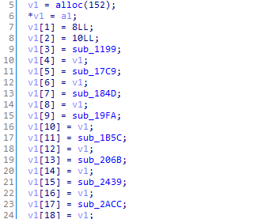

### FunTiger

#### Overview

FunTiger is compiled by a Fun-Tiger compiler ("Fun" is short for "functional"). And you can refer to Chapter 15, TigerBook for the implementation of the compiler. 

To solve this challenge, you may first get yourself comfortable with basic functional style code. After finishing the revering part, you are supposed to solve another number theory problem. 

#### Reverse Part

*Note, I'm still new to functional programming, so there may be a few mistakes in this article. Welcome to correct them if you find some.*

At the beginning of every (tiger-)function, a closure is built, which includes a static link (points to the outer closure), arguments and local variables. Functions in closures are now function variables, which includes a function pointer and a static link (standards for the outer environment of the function). 




It may be boring to reverse every such closure structure. Luckily, there are only about thirty tiger functions and most of them are very simple ):

Another reading comprehension challenge is that loops are now replaced by recursion. That probably won't bother you too much. 

Besides, funTiger uses continuation-based I/O. For example, *the built-in getchar function does not return a string; instead, getchar takes an argument that is a stringConsumer and passes the newly read character to that consumer.* 

And lazy evaluation mechanism is used in some places. This technique is not implemented in the compiler. We manually apply it when writing source code. 

The origin tiger code is listed below: 

``` c
let
  type intConsumer = int -> answer
  type intList = {head: int, tail: intList}
  type intListChecker = intList -> int
  type intThunk = () -> int
  type intPair = {a: int, b: int}

  type pNum = {a: int, b: int, p: int}
  type pNumList = {num: pNum, next: pNumList}
  type pNumsConsumer = pNumList -> answer
  type checker = intList -> int

  var numPNum := 8
  var prec := 10

  function tigerExit() = exit_0()

  function getInput(consumer: pNumsConsumer) = 
    let 
      function getInputHelper(i: int, res: pNumList) = 
        let 
          function nexta(s: string) = 
            let 
              var a1 := xori(myord(s), 114)
              function nextChar1(s: string) = 
                let 
                  var a2 := a1 * 256 + myord(s)
                  function nextChar2(s: string) = 
                    nextb(a2 * 256 + myord(s))
                in 
                  getchar(nextChar2)
                end
            in 
              getchar(nextChar1)
            end
            
          function nextb(a: int) = 
            let 
              function nextChar(s: string) = 
                let 
                  var b1 := xori(myord(s), 40)
                  function nextChar_(s: string) = 
                    nextp(a, b1 * 256 + myord(s))
                in 
                  getchar(nextChar_)
                end
            in 
              getchar(nextChar)
            end
          
          function nextp(a: int, b: int) = 
            let 
              function nextChar(s: string) = 
                nextPNum(pNum{a=a, b=b, p=xori(myord(s), 56)})
            in 
              getchar(nextChar)
            end

          function nextPNum(pn: pNum) =
            if i = numPNum-1  then consumer(pNumList{num=pn, next=res})
            else getInputHelper(i+1, pNumList{num=pn, next=res})
        in 
          getchar(nexta)
        end
    in 
      getInputHelper(0, nil)
    end

  function gcd(a: int, b: int): int = 
    if b = 0 then a 
    else gcd(b, a - (a/b)*b)

  function gcdExt(n: int, m: int): intPair =
    let 
      function gcdExtHelper(n: int, m: int, x1: int, y1: int, x2: int, y2: int): intPair = 
        let in 
          if m=0 then intPair{a=x1, b=y1}
          else gcdExtHelper(m, n-(n/m)*m, x2, y2, x1-(n/m)*x2, y1-(n/m)*y2)
        end
      in
        gcdExtHelper(n, m, 1, 0, 0, 1)
      end

  function valuation(a: int, p: int): intPair = 
    let 
      function valuationHelper(a:int, k:int): intPair = 
        if a = (a/p)*p then valuationHelper(a/p, k+1)
        else intPair{a=a, b=k}
      in 
        valuationHelper(a, 0)
      end

  function checkOneSeries(p: pNum, cont: intListChecker): int = 
    let 
      var gcd_a_b := gcd(p.a, p.b)
      var cp := pNum{a=p.a/gcd_a_b, b=p.b/gcd_a_b, p=p.p}

      function genSeries(p: pNum): intList = 
        let 
          var va := valuation(p.a, p.p)
          var vb := valuation(p.b, p.p)


          type nextpThunk = () -> pNum
          type nextpThunkWrap = () -> () -> pNum

          function genOneSeries_1_thunk_wrap1(): nextpThunk = 
            let 
              var cache := pNum{a=va.a, b=vb.a, p=p.p}
              function genOneSeries_1_thunk(): pNum = cache
            in 
              genOneSeries_1_thunk
            end

          function genOneSeries(thunkwrap1: nextpThunkWrap, i: int): intList = 
            let 
              var p := thunkwrap1()()
              var tu := gcdExt(p.b, p.p)
              var t := tu.a 
              var u := tu.b
              var nt := p.a * t
              var q := nt / p.p 
              var rq := if (nt<0 & nt <> q*p.p) then q-1 else q
              var a := nt - rq*p.p
              function genOneSeries_1_thunk_wrap2(): nextpThunk = 
                let 
                  var cache := pNum {a=rq*p.b+u*p.a, b=p.b, p=p.p}
                  function genOneSeries_1_thunk(): pNum = cache
                in 
                  genOneSeries_1_thunk
                end
            in 
              if i = prec-1 then intList{head=a, tail=nil}
              else intList{head=a, tail=genOneSeries(genOneSeries_1_thunk_wrap2, i+1)}
            end
        in
          intList{head=va.b-vb.b, tail=genOneSeries(genOneSeries_1_thunk_wrap1, 0)}
        end
    in
      cont(genSeries(cp))
    end

  function doCheck(inp: pNumList) = 
    let 
      function checkHelper(idx: int, inp: pNumList): int = 
        if inp = nil then 
          if idx = numPNum then 1 else 0
        else if checkOneSeries(inp.num, getChecker(idx)) = 1
        then checkHelper(idx+1, inp.next)
        else 0

      function getChecker(idx: int): checker  = 
        let 
          var secrets := getSecrets()
          var ans := secrets[idx]
          function checker(inp: intList): int = 
            let 
              function getCheckerHelper(idx: int, inp: intList): int = 
                if inp = nil then 
                  if idx = prec+1 then 1 else 0
                else if inp.head = ans[idx]
                then getCheckerHelper(idx+1, inp.tail)
                else 0
            in
              getCheckerHelper(0, inp)
            end
        in 
          checker
        end
    in 
      output(checkHelper(0, inp))(inp)
    end
  
  function output(pass: int): pNumsConsumer = 
    let
      function right(inp: pNumList) = 
        let
          function beginPrintPs() = 
            printPNum(inp)
          function printPNum(plst: pNumList) = 
            let 
              var pn := plst.num
              function printa1() = print(chr(xori(pn.a/256/256,114)), printa2)
              function printa2() = print(chr(pn.a/256-(pn.a/256/256)*256), printa3)
              function printa3() = print(chr(pn.a-(pn.a/256)*256), printb1)
              function printb1() = print(chr(xori(pn.b/256,40)), printb2)
              function printb2() = print(chr(pn.b-(pn.b/256)*256), printp)
              function printp() = print(chr(xori(pn.p,56)), printnext)
              function printnext() = 
                if plst.next <> nil then printPNum(plst.next)
                else donePrintPs()
            in 
              printa1()
            end
          function donePrintPs() = 
            print("}\n", tigerExit)
        in
          print("Good Job! Your flag is ACTF{", beginPrintPs)
        end
      function wrong(inp: pNumList) = 
        print("It is as much art as it is science. \n", tigerExit)
    in 
      if pass = 0 
      then wrong
      else right
    end

in
  getInput(doCheck)
end

```

And some C bindings:

```c
#include "tiger.h"
#include <stdlib.h>

#define NUMPNUM 8
#define PREC 10

long secret0[PREC + 1] = {0, 9, 32, 55, 95, 63, 86, 83, 48, 82, 73};
long secret1[PREC + 1] = {1, 6, 31, 56, 15, 22, 6, 74, 36, 63, 55};
long secret2[PREC + 1] = {0, 92, 70, 104, 79, 8, 2, 101, 85, 88, 67};
long secret3[PREC + 1] = {1, 41, 67, 1, 2, 3, 61, 4, 48, 78, 29};
long secret4[PREC + 1] = {-2, 69, 30, 69};
long secret5[PREC + 1] = {2, 30, 23, 37, 15, 48, 71, 4, 6, 48, 66};
long secret6[PREC + 1] = {-1, 48, 69, 103, 39, 63, 4, 22, 20, 54, 67};
long secret7[PREC + 1] = {0, 13, 84, 91, 106, 50, 109, 42, 126, 16, 94};
long *secrets[NUMPNUM] = {secret0, secret1, secret2, secret3,
                          secret4, secret5, secret6, secret7};

long **getSecrets() { return secrets; }

long valid(char c) {
  return ((c >= 'A') && (c <= 'Z')) || ((c >= 'a') && (c <= 'z')) ||
         ((c >= '0') && (c <= '9')) || (c == '_');
}

long myord(tiger_str *s) {
  if (s->length == 0 || !valid(s->chars[0]))
    return -1;
  else
    return s->chars[0];
}
```


#### Number Theory Problem

This part is inspired by the *p-adic number*. It is a simple but interesting idea. I won't cover it in this WP. You can refer to Internet (e.g. wikipedia) for this definition. 

The funTiger executable will receive a 24-bits integer $a$, a 16-bits integer $b$ and a 8-bits integer $p$. And then calculate the p-series $\frac{a}{b} (mod\ p)$. Some p-series are infinite, funTiger will truncate it (the precision is 10). Note that the truncation can be interpreted as doing calucation under a finite field $F(p^n)$. 

To solve this problem, you can simply enumerate all *valid* $b$ and $p$, and then calucate $a = b*\frac{a}{b}\ mod\ p^{prec}$.  After checking the validity, you should get the unique answer. 

```python
import string
import math
import subprocess

# ,0,0,0,0,0,0,0,0
ALLOW_CHARS = string.ascii_letters + string.digits + "_"
ALLOW_CHARSI = [ord(i) for i in ALLOW_CHARS]
ss = [
  [0, 9, 32, 55, 95, 63, 86, 83, 48, 82, 73],
  [1, 6, 31, 56, 15, 22, 6, 74, 36, 63, 55],
  [0, 92, 70, 104, 79, 8, 2, 101, 85, 88, 67],
  [1, 41, 67, 1, 2, 3, 61, 4, 48, 78, 29],
  [-2, 69, 30, 69,0,0,0,0,0,0,0],
  [2, 30, 23, 37, 15, 48, 71, 4, 6, 48, 66],
  [-1, 48, 69, 103, 39, 63, 4, 22, 20, 54, 67],
  [0, 13, 84, 91, 106, 50, 109, 42, 126, 16, 94],
]

def good(a):
  # return (a>=32) and (a<127)
  return (a<127) and (a in ALLOW_CHARSI)

def func_get_prime(n):
  return filter(
    lambda x: (not [x%i for i in range(2, int(math.sqrt(x))+1) if x%i ==0]) and (good(x^0x38)), range(2,n+1)
  )

ps = list(func_get_prime(256))
print(ps)

flags = [""]
for s in ss:
  frags = []
  for p in ALLOW_CHARSI:
    p ^= 0x38
    if p == 0 :
      continue
    pi = 1
    m = 0
    for i in range(1, len(s)):
      m += s[i] * pi
      pi *= p
    o = s[0]
    while o>0:
      m *= p
      o -= 1
    for b1 in ALLOW_CHARSI:
      for b2 in ALLOW_CHARSI:
        b = (b1 ^ 0x28) * 256 + b2
        a = b*m % pi 
        o = s[0]
        while (o<0) and (a % p == 0):
          a //= p
          o += 1
        if o < 0:
          continue
        a1 = (a//256//256)^0x72
        a2 = (a // 256) % 256
        a3 = a % 256
        if good(a1) and good(a2) and good(a3):
          flag_proc = "".join([chr(i) for i in [a1,a2,a3,b1,b2,p^0x38]])
          frags.append(flag_proc)
  print(frags)
  nflags = []
  for flag in flags:
    for frag in frags:
      nflags.append(frag + flag)
  flags = nflags

print("--- begin test ---")
for flag in flags:
  p = subprocess.Popen("./funTiger", stdout=subprocess.PIPE, stdin=subprocess.PIPE, stderr=subprocess.PIPE,)
  out, err = p.communicate((flag).encode())
  if out != b'It is as much art as it is science. \n':
    print(out)
```

FLAG: `ACTF{TEJgw_dfJ38wV5EIUIgqDx_wj5XqrSE6WK3q78lIcSWXa99G}`


