## Inflated

[TOC]


### Overview

You may find some weird `cleanup()` annotation at the beginning of `main` function and some mis-annotated `catch()` blocks in IDA. 

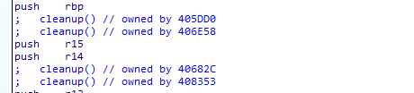

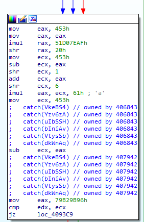

This is because the `eh_frame` related structures are tampered. You are supposed to find why it goes wrong first. 

Next, you need to de-flat the flatten control flow. You are supposed to find how the control flow are flatten. After the patterns are figured out, it is not difficult to write a script to de-flat it. 

The final step is very easy, just read the code and solve two easy puzzles.  

### Challenge Study

Preliminary: 

- [Itanium C++ ABI: Exception Handling ($Revision: 1.22 $)](https://itanium-cxx-abi.github.io/cxx-abi/abi-eh.html). You are supposed to have a basic understanding of what the personality routine is. 
- [Control Flow Flatten](https://blog.quarkslab.com/deobfuscation-recovering-an-ollvm-protected-program.html). You are supposed to be familiar with the following graph: 
  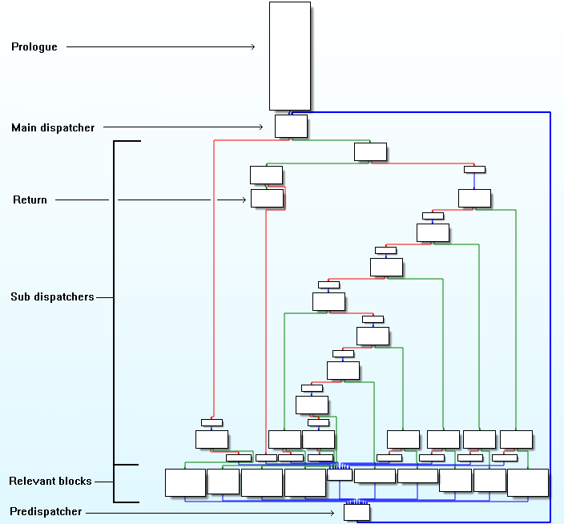

Compare the personality routine used in *Inflated* with the one in the standard libc++abi, you will find some differences :

1. The `LandingPad` is encrypted by some `xor`: 
   
2. The `ttypeIndex` of a `StdObfException` object is calculated by the original `ttypeIndex` (got from the second argument of `__cxa_throw`) and the value of the first field of the thrown exception object. 
   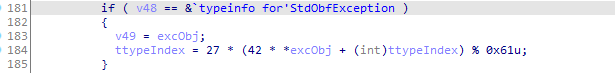

After we recover the original `LandingPad`, IDA should be able to parse the program successfully. 

And we have figured out that the `ttypeIndex` is determined by the first field of the thrown `StdObfException` object and the `lptinfo` passed to `__cxa_throw`.  The value of the first field of the thrown `StdObfException` object comes from the second input passed to the construct of `StdObfException`. 

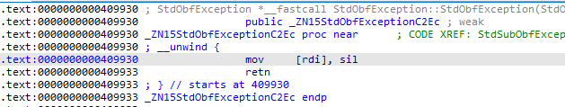

Take the following code as an example. The `lptinfo` is `_ZTI6aQxES2` which is fixed, while the second input passed to the construct of `StdObfException` depends on the input char. 

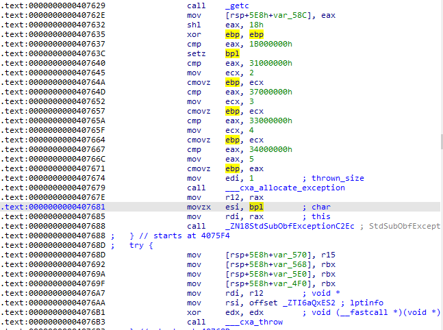

At the catching code point, `ttypeIndex` is used to determine the next dispatch key and then jump to the *pre-dispatcher* block. 


The `pre-dispatcher` block prepares some constants and finally jump to the *main-dispatcher* block. 

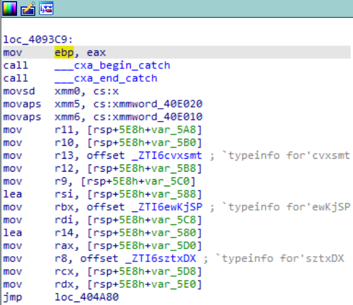


To sum up, the next *relevant* block is determined both by a `lptinfo` embedded statically at the end of every *relevant* block and a selector value dynamically calculated and passed to the constructor of `StdObfException`. And at the end of every *relevant* block, rather than just jump to the *pre-dispatcher* block, we call `__cxa_throw` to do a second dispatch. The control flow of one dispatch process is  `... -> main dispatcher -> sub dispatchers -> relevant block -> throw StdObfException exception -> Secondary dispatchers -> pre-dispatcher -> main dispatcher -> ...`

Besides, there are some real exceptions thrown by the program. For these exceptions, the second dispatch takes places at the end of the LandingPad block. That is, the control flow should be `... -> main dispatcher -> sub dispatchers -> relevant block that throws real exceptions -> the according real LandingPad block -> throw StdObfException exception -> Secondary dispatchers -> pre-dispatcher -> main dispatcher -> ... ` . 

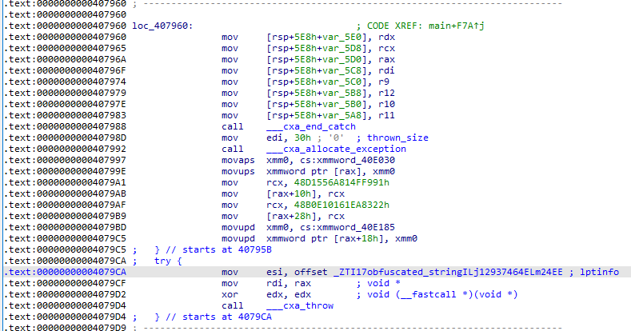

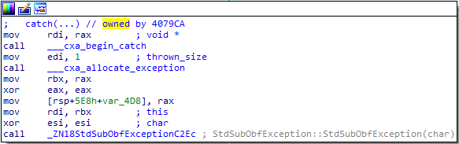


### Solution

To de-flat a flatten control flow, there are two steps:

1. Find all relevant blocks; 
2. Find the control flow relations of these relevant blocks. 

#### Find all relevant blocks

- We use the [BARF](https://github.com/programa-stic/barf-project) framework.  

This part is very easy, we can search from *main dispatcher* and find all successors of *sub dispatchers* that are not themselves *dispatchers*. 

*Sub dispatchers* are composed of two instructions: the first one is a `cmp` instruction with a register and a constant value as its inputs and the second one is a condition jump instruction. So the `sub dispatchers` can be distinguished by the following code: 

```python
  isCmpRI = lambda instr: instr.mnemonic == "cmp" and\
    hasattr(instr.operands[0], "_X86RegisterOperand__key") and\
    hasattr(instr.operands[1], "_X86ImmediateOperand__key") 
  isCJmp = lambda instr: instr.mnemonic.startswith("j") and \
    instr.mnemonic != "jmp"
  isSubDispatcher = lambda bb: (len(bb.instrs) == 2) and\
     isCmpRI(bb.instrs[0]) and isCJmp(bb.instrs[1])
```

Then we can find all relevant blocks: 

```python
class PatchHelper:
  ## ......
  def block(self, addr):
    bb = self.cfg.find_basic_block(addr)
    if bb is None:
      bb = barf.bb_builder.strategy._disassemble_bb(addr, barf.binary.ea_end, {})
    return bb

def get_relevant_blocks(cfg, patch_helper, main_dispatcher):
  isCmpRI = lambda instr: instr.mnemonic == "cmp" and\
    hasattr(instr.operands[0], "_X86RegisterOperand__key") and\
    hasattr(instr.operands[1], "_X86ImmediateOperand__key") 
  isCJmp = lambda instr: instr.mnemonic.startswith("j") and \
    instr.mnemonic != "jmp"
  isSubDispatcher = lambda bb: (len(bb.instrs) == 2) and\
     isCmpRI(bb.instrs[0]) and isCJmp(bb.instrs[1])
  relevant_blocks = []
  visited = set()
  q = SimpleQueue()
  q.put(patch_helper.block(main_dispatcher))
  while not q.empty():
    bb = q.get()
    if isSubDispatcher(bb):
      for succ, cond in bb.branches:
        if succ in visited:
          continue
        q.put(patch_helper.block(succ))
        visited.add(succ)
    else:
      relevant_blocks.append(bb)
  return relevant_blocks
```

Relevant blocks:

``` 
*******************relevant blocks************************
main_dispatcher:0x404a80
relevant_blocks: ['0x409437', '0x406443', '0x404ab8', '0x408031', '0x407842', '0x407d31', '0x407437', '0x407f4f', '0x4076bd', '0x407a6b', '0x40723e', '0x407fc4', '0x409458', '0x407bc7', '0x40732f', '0x407ebc', '0x407566', '0x407960', '0x4070fa', '0x405e7a', '0x4078e3', '0x407e5a', '0x4074ca', '0x405c87', '0x407741', '0x407af5', '0x4072b4', '0x405ded', '0x4077b6', '0x407c6b', '0x4073a4', '0x405b29', '0x4075f9', '0x407a06', '0x4071aa', '0x406cfe', '0x406c94', '0x406ef0', '0x406859', '0x40707d', '0x406b62', '0x406f5f', '0x4065c9', '0x406e5d', '0x406a72', '0x406d7b', '0x406704', '0x406def', '0x406964', '0x40944b', '0x4064a5', '0x405469', '0x405a5f', '0x404fae', '0x40532c', '0x40589c', '0x404d58', '0x4053d3', '0x405923', '0x404ec5', '0x40529a', '0x4057b8', '0x404bc4', '0x405f2a', '0x4056f0', '0x406299', '0x4068f0', '0x4063b0', '0x406bf9', '0x406323', '0x406646', '0x40620f', '0x406b00', '0x4060e7', '0x4067bb', '0x40617c', '0x4069e3', '0x40606d', '0x406521', '0x4051fe', '0x405647', '0x404e14', '0x4055b5', '0x4050cc', '0x40550b', '0x404ca4']
```


#### Find the flow 

A good idea is to abstract the `throw StdObfException -> catch` process and do the *one basic block symbolic execution* (You can refer to [Deobfuscation: recovering an OLLVM-protected program](https://blog.quarkslab.com/deobfuscation-recovering-an-ollvm-protected-program.html) or [利用符号执行去除控制流平坦化](https://security.tencent.com/index.php/blog/msg/112) for more information). However, in this section, I will give a dirtier but easier solution. 

To find the flow, we can just trace a normal execution and print some necessary information at of relevant blocks. Although we may not be able to find all the flows since some branches are not taken at a single execution, we can utilize the extracted information to recover partial control flow and figure out how to adjust inputs to recover more. 

The GDB trace script can be generated by: 

``` python
  cmds = """\
set pagination off

b *0x40A3D4
commands
  silent
  printf "landingPad: %x\\n", $rdx
  continue
end

b _ZN18StdSubObfExceptionC2Ec
commands
  silent
  printf "selector: %x\\n", $rsi
  continue
end 

define mytrace 
  break $arg0
  commands
    silent
    printf "%x\\n", $pc
    python gdb.execute('continue')
  end
end
"""
  for bb in relevant_blocks:
    cmds += (f"mytrace *{hex(bb.address)} \n")
  cmds += "run\n"
  with open("test.gdb", "w") as f:
    f.write(cmds)

```

Then, use the command to do the trace: `gdb inflated.bak -x test.gdb --batch < testin > testout`. 

The simple test input: 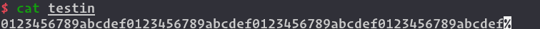

`testout`:

```
Breakpoint 1 at 0x40a3d4
......
Breakpoint 88 at 0x404ca4
4075f9
selector: 0
landingPad: 4089bf
4072b4
selector: 0
landingPad: 408503
4075f9
selector: 2
landingPad: 4089bf
4060e7
selector: 0
......
40617c
selector: 0
landingPad: 409100
409437
[Inferior 1 (process 13732) exited normally]
```

Parse logs and reconstruct flows:

```python
def parse_logs(logfn, prologue, patch_helper):
  with open(logfn, "r") as f:
    t = f.readlines()
  i = 0
  selector_s = "selector: "
  landingpad_s = "landingPad: "
  relations = set()
  laddr = prologue
  lselector = 0
  landingpad = 0
  while i < len(t):
    try:
      addr = int(t[i], 16)
    except:
      i += 1
      continue
    if not laddr is None:
      relations.add((laddr, lselector, addr))
    if t[i+1].startswith(selector_s):
      selector = int(t[i+1][len(selector_s):], 16)
      i += 2
    elif t[i+1].startswith(landingpad_s):
      landingpad = int(t[i+1][len(landingpad_s):], 16)
      relations.add((addr, -1, landingpad))
      addr = landingpad
      while not patch_helper.is_unreachable(patch_helper.block(addr).direct_branch):
        addr = patch_helper.block(addr).direct_branch
      if t[i+2].startswith(selector_s):
        selector = int(t[i+2][len(selector_s):], 16)
      i += 3
    elif t[i+1].startswith("[Inferior "):
      i += 1
    else:
      print("Warning: %x doesn't have selector. "%addr)
      exit(0)
    laddr = addr
    lselector = selector
  return list(relations)

print('************************flow******************************')
relations = parse_logs(sys.argv[3], prologue, patch_helper)
relations.sort(key = lambda x:x)
flow = {}
for bb, selector, child in relations:
  if bb in flow:
    while len(flow[bb]) < selector:
      flow[bb].append(-1)
    flow[bb].append(child)
    assert(len(flow[bb]) == selector+1)
  else:
    flow[bb] = [child]
for (k, v) in list(flow.items()):
    print('%#x:' % k, [hex(child) for child in v])

```

Flows:

```
************************flow******************************
0x404820: ['0x4075f9']
0x404ab8: ['0x404ab8', '0x406c94']
0x404bc4: ['0x407bc7']
0x404ca4: ['0x406bf9']
0x404ec5: ['0x4053d3']
0x404fae: ['0x406b00']
0x4051fe: ['0x40707d']
0x4053d3: ['0x406521']
0x405469: ['0x407d31']
0x4056f0: ['0x405a5f', '0x4056f0']
0x4057b8: ['0x404ab8']
0x405923: ['0x405923', '0x406e5d']
0x405a5f: ['0x4067bb']
0x405b29: ['0x406964', '0x406646']
0x405c87: ['0x405c87', '0x407437']
0x405f2a: ['0x405f2a', '0x4063b0']
0x4060e7: ['0x40723e']
0x40617c: ['0x409437']
0x40620f: ['0x405f2a']
0x406299: ['0x404bc4', '0x4057b8']
0x4063b0: ['0x4063b0', '0x405469']
0x4064a5: ['0x406704', '0x40620f']
0x406521: ['0x4074ca', '0x404bc4']
0x4065c9: ['0x40723e']
0x406646: ['0x406964']
0x406704: ['0x405c87']
0x4067bb: ['0x4082b6']
0x406964: ['0x405b29', '0x404ca4']
0x4069e3: ['0x408281']
0x406a72: ['0x404fae']
0x406b00: ['0x406299']
0x406bf9: ['0x405923']
0x406c94: ['0x4074ca']
0x406cfe: ['0x40723e']
0x406e5d: ['0x406e5d', '0x4077b6']
0x406f5f: ['0x406f5f', '0x407566']
0x40707d: ['0x40707d', '0x407960']
0x4070fa: ['0x406f5f']
0x4071aa: ['0x4056f0']
0x40723e: ['0x4072b4']
0x4072b4: ['0x4075f9', '0x4071aa']
0x407437: ['0x407437', '0x4064a5']
0x4074ca: ['0x404ec5', '0x407c6b']
0x407566: ['0x407566', '0x407a6b']
0x4075f9: ['0x4072b4', '-0x1', '0x4060e7', '0x406cfe', '0x4078e3', '0x4065c9']
0x4076bd: ['0x404ec5']
0x4077b6: ['0x406bf9', '0x4070fa']
0x4078e3: ['0x40723e']
0x407960: ['0x4081f5']
0x407a6b: ['0x4070fa', '0x406704']
0x407bc7: ['0x406a72', '0x407bc7']
0x407c6b: ['0x4069e3']
0x407d31: ['0x407d31', '0x407ebc']
0x407ebc: ['0x407ebc', '0x40617c']
0x4081f5: ['0x405b29']
0x408281: ['0x4051fe']
0x4082b6: ['0x4076bd']
```

#### Patch

At the final step, we need to patch the program to recover the control flow. 

First, we need to find the right place to do the patch. In fact, the `call ___cxa_throw`, the instructions preparing arguments for it and the jump to a unreachable block after the `call ___cxa_throw` are redundancy in the de-flatten code. These instructions can be used to place new instructions. Besides, all *main dispatcher* and *sub dispatchers* are redundancy as well. 

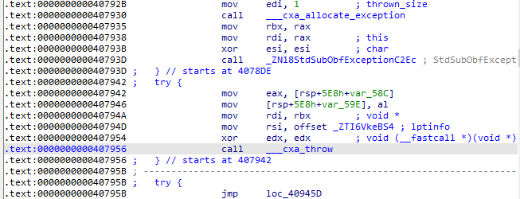

For the block that has only one successor, we can just add a jump instruction at the end of block. For those have more than one successors, we need to dispatch the control flow by the `esi` value: 

```python
  def patch_branches(self, bb, va_targets):
    va_start, size = self.get_patchable_from_relblk(bb)
    if size < PatchHelper.JMP_SIZE:
      print("[Warning] patch_jmp at block %x may fail. size: %d."%(bb.address, size))
    org_start = va_start
    print(f"va_start: {hex(va_start)}, bb addr: {hex(bb.address)}, size: {size}")
    ## `cmp esi, v` instr takes 3 bytes while `je xxx` takes 6 bytes
    ## And the last jmp instr takes 5 bytes. 
    total_size = 9 * len(va_targets) - 4
    if size < total_size:
      ## If the nop block at the end of current block is not large enough, 
   	  ## try to find another nop block and then jump to it. 
      nx_va_start, nx_size = self.get_nop_by_size(total_size)
      if nx_size == 0:
        print("[Error] `patch_branches` needs a nop block with size larger than %d."%(total_size))
      self.patch_jmp(va_start, nx_va_start)
      va_start, size = nx_va_start, nx_size
    
    for i, t in enumerate(va_targets[:-1]):
      cmp_instr = bytes([0x83,0xfe,i])
      self.do_patch(va_start, cmp_instr)
      va_start += len(cmp_instr)
      cj_instr = bytes([PatchHelper.opcode['j'],PatchHelper.opcode['e']])
      if t == -1:
        ## -1 represent that we do not know the flow for this selector value for now. 
        cj_instr += struct.pack('<i', self.func_terminate-va_start-6)
        # cj_instr = asm(f"je {hex(self.func_terminate)}", vma=va_start)
      else:
        cj_instr += struct.pack('<i', t-va_start-6)
        # cj_instr = asm(f"je {hex(t)}", vma=va_start)
      self.do_patch(va_start, cj_instr)
      va_start += len(cj_instr)
    va_start += self.patch_jmp(va_start, va_targets[-1])
    if va_start > org_start+size:
      print("[Warning] patches at (%x, %x) overlaps next blk. "%(org_start, va_start))
```


#### The final script

``` python
## filename: deflat.py
from ast import Tuple
from xmlrpc.client import Boolean
from barf.barf import BARF
import angr
import struct
import sys
from pwnlib import elf
from queue import SimpleQueue
# from pwn import *

class PatchHelper:
  opcode = {'a' :0x87, 'ae':0x83, 'b' :0x82, 'be':0x86, 'c' :0x82, 'e' :0x84, 'z' :0x84, 'g' :0x8F, 
            'ge':0x8D, 'l' :0x8C, 'le':0x8E, 'na':0x86, 'nae':0x82,'nb':0x83, 'nbe':0x87,'nc':0x83,
            'ne':0x85, 'ng':0x8E, 'nge':0x8C,'nl':0x8D, 'nle':0x8F,'no':0x81, 'np':0x8B, 'ns':0x89,
            'nz':0x85, 'o' :0x80, 'p' :0x8A, 'pe':0x8A, 'po':0x8B, 's' :0x88, 'nop':0x90,'jmp':0xE9, 'j':0x0F}
  JMP_SIZE = 5
  
  def is_unreachable(self, bb):
    if isinstance(bb, int):
      bb = self.block(bb)
    for i in range(len(bb.instrs)):
      if bb.instrs[i].mnemonic != "call":
        continue
      target = bb.instrs[i].operands[0].immediate
      if target == self.func_terminate:
        return True

  def block(self, addr):
    bb = self.cfg.find_basic_block(addr)
    if bb is None:
      bb = barf.bb_builder.strategy._disassemble_bb(addr, barf.binary.ea_end, {})
    return bb

  @staticmethod
  def is_imm(operand):
    return (hasattr(operand, "_X86ImmediateOperand__key"))

  @staticmethod
  def is_reg(operand):
    return (hasattr(operand, "_X86RegisterOperand__key"))

  def is_call_throw(self, instr):
    return instr.mnemonic == "call" and \
        self.is_imm(instr.operands[0]) and\
        instr.operands[0].immediate == self.func_throw

  def is_call_allocate_exception(self, instr):
    return instr.mnemonic == "call" and \
        self.is_imm(instr.operands[0]) and\
        instr.operands[0].immediate == self.func_allocate_exception

  def is_call_obf_exception(self, instr):
    return instr.mnemonic == "call" and \
        self.is_imm(instr.operands[0]) and\
        instr.operands[0].immediate == self.func_obf_exception


  def skip_call_args(self, bb, i):
    while ((bb.instrs[i].mnemonic in ["xor","mov","lea"]) and\
      (len(bb.instrs[i].operands) > 0) and (self.is_reg(bb.instrs[i].operands[0])) and\
      (bb.instrs[i].operands[0].name in ["edx", "rdx", "esi", "rsi", "edi", "rdi"])) or \
      bb.instrs[i].mnemonic == "nop":
      i -= 1
    return i

  def get_patchable_from_relblk(self, bb):
    i = 0 
    end = bb.start_address + bb.size
    while i < len(bb.instrs) and not self.is_call_throw(bb.instrs[i]):
      i += 1
    i = self.skip_call_args(bb, i-1)
    if i == len(bb.instrs) - 1:
      start = end 
    else:
      start = bb.instrs[i+1].address
    self.fill_nops(start, end)
    return (start, end-start)
  
  def __init__(self, proj, elf, barf, cfg) -> None:
    self.p = proj
    obj = proj.loader.main_object
    self.func_terminate = obj.symbols_by_name["__clang_call_terminate"].rebased_addr
    self.func_throw = obj.plt["__cxa_throw"]
    self.func_allocate_exception = obj.plt["__cxa_allocate_exception"]
    self.func_obf_exception = obj.symbols_by_name["_ZN18StdSubObfExceptionC2Ec"].rebased_addr
    self.elf = elf
    self.elfData = bytearray(self.elf.data)
    self.barf = barf
    self.cfg = cfg
    self.nops = []

  def append_nop(self, nopblk):
    if nopblk[1] > 0:
      self.nops.append(nopblk)

  def finalize(self):
    self.nops.sort()
    idx = 0
    while idx < len(self.nops) - 1:
      if self.nops[idx][0] + self.nops[idx][1] != self.nops[idx+1][0]:
        idx += 1
        continue
      self.nops[idx]=(self.nops[idx][0], self.nops[idx][1]+self.nops[idx+1][1])
      del self.nops[idx+1]

  def fill_nops(self, va_start, va_end):
    assert not self.elf is None
    start = self.elf.vaddr_to_offset(va_start)
    end   = self.elf.vaddr_to_offset(va_end)
    for i in range(start, end):
      self.elfData[i] = PatchHelper.opcode['nop']

  def get_nop_by_size(self, min_size):
    for idx, nop in enumerate(self.nops):
      if nop[1] > min_size:
        del self.nops[idx]
        return nop
    return (-1, 0)

  def do_patch(self, va_start, codes):
    start = self.elf.vaddr_to_offset(va_start)
    for i in range(len(codes)):
      self.elfData[start+i] = codes[i]

  def patch_jmp(self, va_start, va_target):
    offset = va_target - va_start - PatchHelper.JMP_SIZE
    jmp = bytes([PatchHelper.opcode['jmp']])+struct.pack('<i', offset)
    self.do_patch(va_start, jmp)
    return PatchHelper.JMP_SIZE

  def patch_branches(self, bb, va_targets):
    va_start, size = self.get_patchable_from_relblk(bb)
    if size < PatchHelper.JMP_SIZE:
      print("[Warning] patch_jmp at block %x may fail. size: %d."%(bb.address, size))
    org_start = va_start
    print(f"va_start: {hex(va_start)}, bb addr: {hex(bb.address)}, size: {size}")
    ## `cmp esi, v` instr takes 3 bytes while `je xxx` takes 6 bytes
    ## And the last jmp instr takes 5 bytes. 
    total_size = (3+6) * len(va_targets) - 4
    if size < total_size:
      ## If the nop block at the end of current block is not large enough, 
   	  ## try to find another nop block and then jump to it. 
      nx_va_start, nx_size = self.get_nop_by_size(total_size)
      if nx_size == 0:
        print("\033[31m[Error]\033[0m `patch_branches` needs a nop block with size larger than %d."%(total_size))
      self.patch_jmp(va_start, nx_va_start)
      va_start, size = nx_va_start, nx_size
    for i, t in enumerate(va_targets[:-1]):
      cmp_instr = bytes([0x83,0xfe,i])
      self.do_patch(va_start, cmp_instr)
      va_start += len(cmp_instr)
      cj_instr = bytes([PatchHelper.opcode['j'],PatchHelper.opcode['e']])
      if t == -1:
        ## -1 represent that we do not know the flow for this selector value for now. 
        cj_instr += struct.pack('<i', self.func_terminate-va_start-6)
        # cj_instr = asm(f"je {hex(self.func_terminate)}", vma=va_start)
      else:
        cj_instr += struct.pack('<i', t-va_start-6)
        # cj_instr = asm(f"je {hex(t)}", vma=va_start)
      self.do_patch(va_start, cj_instr)
      va_start += len(cj_instr)
    va_start += self.patch_jmp(va_start, va_targets[-1])
    if va_start > org_start+size:
      print("[Warning] patches at (%x, %x) overlaps next blk. "%(org_start, va_start))

def get_relevant_blocks(cfg, patch_helper, main_dispatcher):
  isCmpRI = lambda instr: instr.mnemonic == "cmp" and\
    hasattr(instr.operands[0], "_X86RegisterOperand__key") and\
    hasattr(instr.operands[1], "_X86ImmediateOperand__key") 
  isCJmp = lambda instr: instr.mnemonic.startswith("j") and \
    instr.mnemonic != "jmp"
  isSubDispatcher = lambda bb: (len(bb.instrs) == 2) and\
     isCmpRI(bb.instrs[0]) and isCJmp(bb.instrs[1])
  relevant_blocks = []
  visited = set()
  q = SimpleQueue()
  q.put(patch_helper.block(main_dispatcher))
  while not q.empty():
    bb = q.get()
    if isSubDispatcher(bb):
      patch_helper.append_nop((bb.start_address, bb.size))
      for succ, cond in bb.branches:
        if succ in visited:
          continue
        q.put(patch_helper.block(succ))
        visited.add(succ)
    else:
      relevant_blocks.append(bb)
  return relevant_blocks


def parse_logs(logfn, prologue, patch_helper):
  with open(logfn, "r") as f:
    t = f.readlines()
  i = 0
  selector_s = "selector: "
  landingpad_s = "landingPad: "
  relations = set()
  laddr = prologue
  lselector = 0
  landingpad = 0
  while i < len(t):
    try:
      addr = int(t[i], 16)
    except:
      i += 1
      continue
    if not laddr is None:
      relations.add((laddr, lselector, addr))
    if t[i+1].startswith(selector_s):
      selector = int(t[i+1][len(selector_s):], 16)
      i += 2
    elif t[i+1].startswith(landingpad_s):
      landingpad = int(t[i+1][len(landingpad_s):], 16)
      relations.add((addr, -1, landingpad))
      addr = landingpad
      while not patch_helper.is_unreachable(patch_helper.block(addr).direct_branch):
        addr = patch_helper.block(addr).direct_branch
      if t[i+2].startswith(selector_s):
        selector = int(t[i+2][len(selector_s):], 16)
      i += 3
    elif t[i+1].startswith("[Inferior "):
      i += 1
    else:
      print("Warning: %x doesn't have selector. "%addr)
      exit(0)
    laddr = addr
    lselector = selector
  return list(relations)


def generate_gdb_script(relevant_blocks):
  cmds = """\
set pagination off

b *0x40A3D4
commands
  silent
  printf "landingPad: %x\n", $rdx
  continue
end

b _ZN18StdSubObfExceptionC2Ec
commands
  silent
  printf "selector: %x\n", $rsi
  continue
end 

define mytrace 
  break $arg0
  commands
    silent
    printf "%x\\n", $pc
    python gdb.execute('continue')
  end
end
"""
  for bb in relevant_blocks:
    cmds += (f"mytrace *{hex(bb.address)} \n")
  cmds += "run\n"
  with open("test.gdb", "w") as f:
    f.write(cmds)


if __name__ == '__main__':
    if len(sys.argv) < 3:
        print('Usage: python deflat.py filename function_address(hex) [logfile]')
        exit(0)

    # context.arch = "amd64"
    # context.os = "linux"
    # context.endian = "little"

    filename = sys.argv[1]
    start = int(sys.argv[2], 16)

    origin = elf.ELF(filename)
    b = angr.Project(filename, load_options={'auto_load_libs': False, 'main_opts':{'custom_base_addr': 0}})
    barf = BARF(filename)
    cfg = barf.recover_cfg(start=start)
    patch_helper = PatchHelper(b, origin, barf, cfg)
    blocks = cfg.basic_blocks

    prologue = start
    main_dispatcher = patch_helper.block(prologue).direct_branch
    relevant_blocks = get_relevant_blocks(cfg, patch_helper, main_dispatcher)
    nop = patch_helper.get_patchable_from_relblk(patch_helper.block(prologue))
    patch_helper.append_nop(nop)

    print('*******************relevant blocks************************')
    print('main_dispatcher:%#x' % main_dispatcher)
    print('relevant_blocks:', [hex(bb.address) for bb in relevant_blocks])


    if len(sys.argv) < 4:
      generate_gdb_script(relevant_blocks)
      exit(0)

    print('************************flow******************************')
    relations = parse_logs(sys.argv[3], prologue, patch_helper)
    relations.sort(key = lambda x:x)
    flow = {}
    for bb, selector, child in relations:
      if bb in flow:
        while len(flow[bb]) < selector:
          flow[bb].append(-1)
        flow[bb].append(child)
        assert(len(flow[bb]) == selector+1)
      else:
        flow[bb] = [child]
    for (k, v) in list(flow.items()):
        print('%#x:' % k, [hex(child) for child in v])

    print('************************patch*****************************')
    patch_helper.finalize()
    for (parent, childs) in list(flow.items()):
      ## Patch jmps
      blk = patch_helper.block(parent)
      patch_helper.patch_branches(blk, childs)
      ## Nop call allocate_exception and call obf_exception
      for idx, instr in enumerate(blk.instrs):
        if patch_helper.is_call_allocate_exception(instr) or\
          patch_helper.is_call_obf_exception(instr):
          # si = patch_helper.skip_call_args(blk, idx-1)+1
          # start = blk.instrs[si].address
          start = instr.address
          end = instr.address + instr.size
          patch_helper.fill_nops(start, end)

    with open(filename + '.recovered', 'wb') as f:
        f.write(bytes(patch_helper.elfData))
    print('Successful! The recovered file: %s' % (filename + '.recovered'))
```

Work flow:

```sh
$ python deflat.py inflated 0x404820
$ gdb inflated -x test.gdb --batch < testin > testout
$ python deflat.py inflated 0x404820 testout
```

Part of the recovered code (unrecovered flow is patched as `je _clang_call_terminate`):

```c++
int __cdecl main(int argc, const char **argv, const char **envp)
{
  ......
  v3 = fileno(stdin);
  tcgetattr(v3, &intermiosBufBackup);
  cfmakeraw(&intermiosBuf);
  tcsetattr(v3, 0, &intermiosBuf);
  *(_OWORD *)v196 = 0LL;
  v195 = 0LL;
  *(_OWORD *)s = 0LL;
  *(_QWORD *)&v196[13] = 0LL;
  v124 = &v168;
  v123 = &v167;
  v164 = v199;
  v187 = &v198;
  v186 = &v96;
  v185 = &v97;
  v184 = &v100;
  v122 = &s[12];
  v108 = v103;
  v163 = &v197;
  v183 = &v99;
  v162 = &v166;
  ......
  v5 = 0LL;
  do
  {
    v72 = v4;
    v98 = getc(stdin);
    v73 = v98 << 24;
    v74 = v98 << 24 == 0x1B000000;
    if ( v98 << 24 == 0x31000000 )
      v74 = 2;
    if ( v73 == 0x37000000 )
      v74 = 3;
    if ( v73 == 0x33000000 )
      v74 = 4;
    if ( v73 == 0x34000000 )
      v74 = 5;
    v101 = v5;
    v102 = v72;
    v119 = v72;
    if ( v74 )
    {
      if ( v74 == 1 )
        _clang_call_terminate(5LL);
      if ( v74 == 2 )
      {
        v107 = v102 + (4LL << (3 * (unsigned __int8)v101));
        v85 = v98;
      }
      else if ( v74 == 3 )
      {
        v107 = v102 + (5LL << (3 * (unsigned __int8)v101));
        v85 = v98;
      }
      else
      {
        if ( v74 == 4 )
          v107 = v102 + (6LL << (3 * (unsigned __int8)v101));
        else
          v107 = v102 + (7LL << (3 * (unsigned __int8)v101));
        v85 = v98;
      }
      s[v101] = v85;
      v119 = v107;
    }
    v5 = v101 + 1;
    v174 = v119;
  }
  while ( v101 != 11 );
  s[12] = 0;
  v69 = fileno(stdin);
  tcsetattr(v69, 0, &intermiosBufBackup);
  for ( i = 0LL; i < 5; ++i )
    *((_BYTE *)v136 + i) = byte_40E0F3[i] - byte_40E0F8[i];
  v188 = &v190;
  v190 = v136[0];
  v189 = 4LL;
  v191 = 0;
  __isoc99_scanf(&v190, v122);
  v26 = v188;
  v175 = v188;
  *(_OWORD *)v188 = xmmword_40E040;
  v26[4] = 639210836;
  *((_BYTE *)v26 + 20) = 16;
  *(_QWORD *)((char *)v26 + 34) = 0x1005E763241AA6B1LL;
  *(_OWORD *)((char *)v26 + 21) = xmmword_40E148;
  __cxa_begin_catch(v26);
  v155 = strlen(v122);
  v128 = 0LL;
  v113 = 0;
  v125 = v155;
  v147 = 0LL;
  do
  {
    v133 = v125 - 1;
    v86 = v122[v147];
    v160 = v128;
    v110 = v113;
    v176 = v147;
    isalnum(v86);
    v50 = (unsigned int)(v160 + 1);
    *(&v95 + (int)v160) = v86;
    v181 = v176 + 1;
    v130 = v50;
    v112 = v110;
    v146 = 0LL;
    if ( (_DWORD)v50 == 4 )
    {
      do
      {
        v106 = 0LL;
        v149 = v146;
        do
        {
          v199[v106 + 16] = byte_40E071[v106] - byte_40E0B2[v106];
          ++v106;
        }
        while ( v106 < 0x41 );
        v56 = v163;
        *(_QWORD *)v163 = v164;
        v165 = 64LL;
        v169 = (_OWORD *)std::__cxx11::basic_string<char,std::char_traits<char>,std::allocator<char>>::_M_create(
                           v56,
                           &v165,
                           0LL);
        v9 = (void **)v163;
        v10 = v169;
        *(_QWORD *)v163 = v169;
        v11 = v165;
        *(_QWORD *)v164 = v165;
        v12 = MEMORY[5];
        v13 = MEMORY[0x15];
        v14 = MEMORY[0x25];
        v10[3] = MEMORY[0x35];
        v10[2] = v14;
        v10[1] = v13;
        *v10 = v12;
        *(_QWORD *)v187 = v11;
        *((_BYTE *)v10 + v11) = 0;
        v15 = v149;
        *(&v95 + v15) = std::__cxx11::basic_string<char,std::char_traits<char>,std::allocator<char>>::find(
                          v9,
                          (unsigned int)*(&v95 + v149),
                          0LL);
        v177 = *v9;
        operator delete(v177);
        v146 = v149 + 1;
      }
      while ( v149 != 3 );
      v17 = *v186;
      *v183 = (4 * *v57) | ((unsigned __int8)*v186 >> 4) & 3;
      v18 = *v185;
      *v59 = (16 * v17) | ((unsigned __int8)*v185 >> 2) & 0xF;
      *v184 = *v58 + (v18 << 6);
      v152 = v110;
      v151 = 0LL;
      do
      {
        v6 = v151;
        v7 = (unsigned __int8)*(&v99 + v151) / 0xAu;
        v8 = v152;
        v199[v152 + 96] = (unsigned __int8)*(&v99 + v151) % 0xAu;
        v199[v8 + 97] = v7;
        v151 = v6 + 1;
        v152 = v8 + 2;
        v182 = v8 + 2;
      }
      while ( v6 != 2 );
      v130 = 0LL;
      v112 = v182;
    }
    v128 = v130;
    v113 = v112;
    v125 = v133;
    v147 = v181;
  }
  while ( v133 );
  __cxa_end_catch();
  v193 = 152788034LL;
  v192[3] = xmmword_40E130;
  v192[2] = xmmword_40E120;
  v192[1] = xmmword_40E110;
  v192[0] = xmmword_40E100;
  v138 = 152788034LL;
  cipher_helper<12037464u,StList<0ul,1ul,2ul,3ul,4ul,5ul,6ul,7ul,8ul,9ul,10ul,11ul,12ul,13ul,14ul,15ul,16ul,17ul,18ul,19ul,20ul,21ul,22ul,23ul,24ul,25ul,26ul,27ul,28ul,29ul,30ul,31ul,32ul,33ul,34ul,35ul,36ul,37ul,38ul,39ul>>::get_array(
    152788034LL,
    "Knows the futility yet does it anyway. ");
  v55 = v138;
  *(_OWORD *)(v138 + 56) = xmmword_40E16D;
  *(_OWORD *)(v55 + 40) = xmmword_40E15D;
  *(_QWORD *)(v55 + 72) = 0x6FF0E70B5B3F60A4LL;
  v137 = (void *)0x6FF0E70B5B3F60A4LL;
  __cxa_begin_catch((void *)0x6FF0E70B5B3F60A4LL);
  v145 = 0LL;
  do
  {
    v67 = v145;
    *((_DWORD *)v192 + 2 * v145) ^= 0x9005408u;
    v145 = v67 + 1;
  }
  while ( v67 != 8 );
  __cxa_end_catch();
  *(_OWORD *)v75 = xmmword_40E030;
  *((_QWORD *)v75 + 2) = 0x48D1556A814FF991LL;
  *((_QWORD *)v75 + 5) = 0x48B0E10161EA8322LL;
  v25 = -2.526699287193993e95;
  *(_OWORD *)(v75 + 24) = xmmword_40E185;
  __cxa_begin_catch(v75);
  v121 = 0LL;
  v109 = 0;
  do
  {
    v27 = v121;
    v179 = (unsigned __int64 *)v192 + (unsigned int)v121 / 9uLL;
    v28 = *v179;
    v29 = (unsigned int)v121 % 9;
    v30 = pow(v25, (double)(int)((unsigned int)v121 % 9 + 1));
    v178 = v28;
    v31 = v28 % (unsigned int)(int)(v30 + 0.5);
    y = (double)v29;
    v32 = pow(11.0, (double)v29) + 0.5;
    v33 = (unsigned int)(int)v32;
    v25 = v32 - 9.223372036854776e18;
    v158 = v27;
    v157 = v109;
    v111 = v109;
    if ( v31 < v33 )
    {
      v111 = v157 + 1;
      v51 = v199[(int)v157 + 96];
      v52 = pow(v25, y) + 0.5;
      v53 = (unsigned int)(int)v52;
      v25 = v52 - 9.223372036854776e18;
      *v179 = v178 + v51 * v53;
    }
    v121 = (unsigned int)(v158 + 1);
    v109 = v111;
  }
  while ( (_DWORD)v158 != 80 );
  __cxa_end_catch();
  v88 = 1;
  v140 = 0LL;
  do
  {
    v60 = v108;
    v108[8] = 0;
    *(_QWORD *)v60 = 0LL;
    v171 = *((_QWORD *)v192 + v140);
    v126 = 0LL;
    v170 = v140;
    do
    {
      v19 = v126;
      v20 = v126 + 1;
      v21 = pow(v25, (double)((int)v126 + 1));
      v22 = v171 % (unsigned int)(int)(v21 + 0.5);
      v23 = pow(11.0, (double)v19) + 0.5;
      v24 = (unsigned int)(int)v23;
      v25 = v23 - 9.223372036854776e18;
      v103[v22 / v24] = 1;
      v141 = 1LL;
      v89 = v88;
      v126 = v20;
    }
    while ( v20 != 9 );
    do
    {
      v61 = v89;
      if ( !v103[v141] )
        v61 = 0;
      ++v141;
      v115 = v61;
      v89 = v61;
    }
    while ( v141 != 10 );
    v140 = v170 + 1;
    v131 = 0LL;
    v87 = v115;
    v88 = v115;
  }
  while ( v170 != 8 );
  do
  {
    v68 = v108;
    v108[8] = 0;
    *(_QWORD *)v68 = 0LL;
    v172 = (double)((int)v131 + 1);
    v40 = (double)(int)v131;
    v173 = (double)(int)v131;
    v161 = (unsigned int)v131;
    v142 = 0LL;
    do
    {
      v62 = v142;
      v63 = *((_QWORD *)v192 + v142);
      v64 = v63 % (unsigned int)(int)(pow(v40, v172) + 0.5);
      v65 = pow(11.0, v173) + 0.5;
      v66 = (unsigned int)(int)v65;
      v40 = v65 - 9.223372036854776e18;
      v103[v64 / v66] = 1;
      v142 = v62 + 1;
      v144 = 1LL;
      v90 = v87;
    }
    while ( v62 != 8 );
    do
    {
      v71 = v90;
      if ( !v103[v144] )
        v71 = 0;
      ++v144;
      v116 = v71;
      v90 = v71;
    }
    while ( v144 != 10 );
    v131 = (unsigned int)(v161 + 1);
    v132 = 0LL;
    v92 = v116;
    v87 = v116;
  }
  while ( (_DWORD)v131 != 9 );
  do
  {
    v54 = v108;
    v108[8] = 0;
    *(_QWORD *)v54 = 0LL;
    v135 = 3 * ((unsigned int)v132 / 3);
    v134 = 3 * ((unsigned int)v132 % 3) + 1;
    v129 = 0LL;
    v159 = (unsigned int)v132;
    do
    {
      v34 = v129;
      v35 = *((_QWORD *)v192 + (int)(v135 + (unsigned int)v129 / 3));
      v36 = (v134 + (unsigned int)v129 % 3) % 9;
      v37 = v35 % (unsigned int)(int)(pow(v40, (double)(v36 + 1)) + 0.5);
      v38 = pow(11.0, (double)v36) + 0.5;
      v39 = (unsigned int)(int)v38;
      v40 = v38 - 9.223372036854776e18;
      v103[v37 / v39] = 1;
      v129 = (unsigned int)(v34 + 1);
      v150 = 1LL;
      v94 = v92;
    }
    while ( v34 != 8 );
    do
    {
      v70 = v94;
      if ( !v103[v150] )
        v70 = 0;
      ++v150;
      v104 = v70;
      v94 = v70;
    }
    while ( v150 != 10 );
    v132 = (unsigned int)(v159 + 1);
    v92 = v104;
  }
  while ( (_DWORD)v159 != 8 );
  v48 = v108;
  v108[8] = 0;
  *(_QWORD *)v48 = 0LL;
  v127 = 0LL;
  do
  {
    v41 = v127;
    v42 = 9 - v127;
    if ( !(_DWORD)v127 )
      v42 = 0;
    v43 = *((_QWORD *)v192 + v42);
    v44 = v127 + 1;
    v45 = v43 % (unsigned int)(int)(pow(v40, (double)((int)v127 + 1)) + 0.5);
    v46 = pow(11.0, (double)v41) + 0.5;
    v47 = (unsigned int)(int)v46;
    v40 = v46 - 9.223372036854776e18;
    v103[v45 / v47] = 1;
    v143 = 1LL;
    v91 = v104;
    v127 = v44;
  }
  while ( v44 != 9 );
  do
  {
    v49 = v91;
    if ( !v103[v143] )
      v49 = 0;
    ++v143;
    v117 = v49;
    v91 = v49;
  }
  while ( v143 != 10 );
  v16 = v108;
  v108[8] = 0;
  *(_QWORD *)v16 = 0LL;
  v139 = 0LL;
  do
  {
    v76 = v139 + 1;
    v77 = v139 == 8;
    v78 = v139 + 1;
    if ( v139 == 8 )
      v78 = 0;
    v79 = *((_QWORD *)v192 + v139);
    v80 = v79 % (unsigned int)(int)(pow(v40, (double)(v78 + 1)) + 0.5);
    v81 = pow(11.0, (double)v78) + 0.5;
    v82 = (unsigned int)(int)v81;
    v40 = v81 - 9.223372036854776e18;
    v103[v80 / v82] = 1;
    v148 = 1LL;
    v93 = v117;
    v139 = v76;
  }
  while ( !v77 );
  do
  {
    v83 = v93;
    if ( !v103[v148] )
      v83 = 0;
    ++v148;
    v118 = v83;
    v93 = v83;
  }
  while ( v148 != 10 );
  return 0;
}
```

To recover more flows, we needs to first input `0x1B` in the raw mode, you can refer to [keyboard-protocol](https://sw.kovidgoyal.net/kitty/keyboard-protocol/) for more information. 

#### Solve the Puzzles

The first part is rather easy, you just need to input `↑↑↓↓→←→←3417`. The source code:

```c++
  int part1_size = 12;
  while(count < part1_size) {
    char a = getchar();
    if (a == 27) {
      if (getchar() == 91) {
        char c = getchar();
        try {
          rmCjJ0(true, c);
        } catch(Le3KW5 &cc) {
          char c = cc.state;
          if (c == 65) {
            state += 0ull << (3 * count);
          } else if (c==66) {
            state += 2ull << (3 * count);
          } else if (c==67) {
            state += 1ull << (3 * count);
          } else if (c==68) {
            state += 3ull << (3 * count);
          }
        }
        flag[count] = c;
      }
    } else if (a=='1') {
      state += 4ull << (3 * count);
      flag[count] = a;
    } else if (a=='7') {
      state += 5ull << (3 * count);
      flag[count] = a;
    } else if (a=='3') {
      state += 6ull << (3 * count);
      flag[count] = a;
    } else if (a=='4') {
      state += 7ull << (3 * count);
      flag[count] = a;
    }
    count += 1;
  }
  // ... Second Part ...
  // Check Part
  if (... && state == 0xb3e659480) {
    std::cout << LIT("Congratulation! \n") << LIT("Your flag is ACTF{") << flag << LIT("_amazing!}") << std::endl;
  }
```

The second part is a diagonal sudoku with the last column moved to the first column. You can solve it with Z3 or just find one on the Internet. 

The sudoku instance:

```
  ## Original Data         Real diagonal sudoku you need to solve 
  (0,0,0,0,0,0,0,0,4),   #->      (0,0,0,0,0,0,0,4,0),
  (0,0,0,5,0,0,0,7,6),   #->      (0,0,5,0,0,0,7,6,0),
  (0,0,0,0,0,4,0,0,1),   #->      (0,0,0,0,4,0,0,1,0),
  (0,0,0,0,0,0,0,0,8),   #->      (0,0,0,0,0,0,0,8,0),
  (0,0,6,3,9,0,0,0,0),   #shift   (0,6,3,9,0,0,0,0,0),
  (0,0,0,0,0,3,0,5,0),   #->      (0,0,0,0,3,0,5,0,0),
  (0,2,9,0,0,8,0,6,0),   #->      (2,9,0,0,8,0,6,0,0),
  (0,0,7,0,0,9,3,0,0),   #->      (0,7,0,0,9,3,0,0,0),
  (0,3,0,0,0,0,1,0,0),   #->      (3,0,0,0,0,1,0,0,0),
```

FLAG: `ACTF{AABBCDCD3417WT05ICpTW0tcPyYxETgMGTBDUSphES1TLgwtVUwd_amazing!}`


