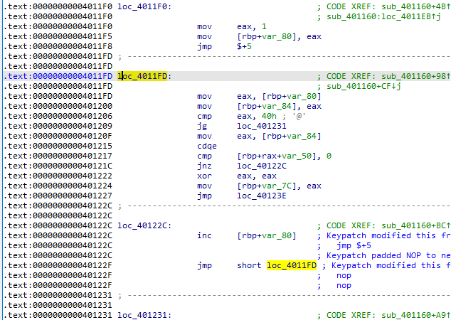
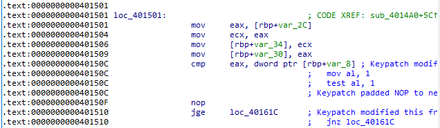
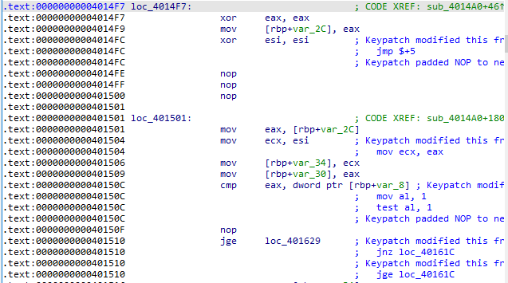
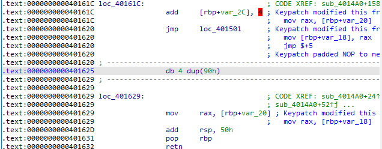
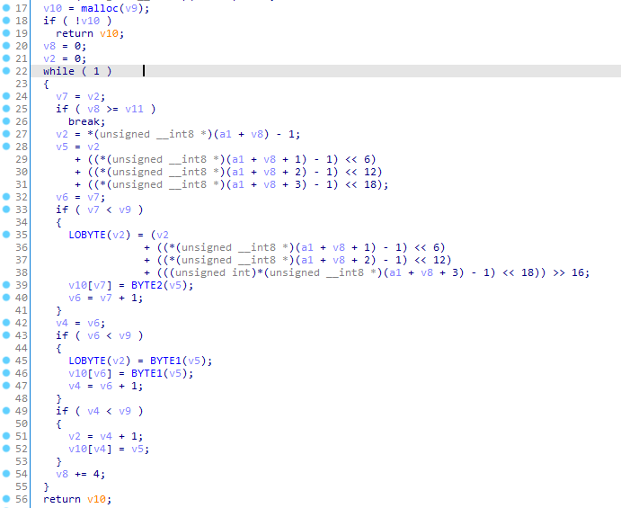

## Loop 

`Opt.cc` 中有三种破坏循环体的做法，每次破坏循环体时都在 log 文件内记录了一定的日志以辅助恢复。

#### Pattern 1 - Loop Latch Deletion

首先打开 main 二进制，可以发现不少类似于这样的"无用"指令pattern：

```assembly
.text:00000000004011F0 loc_4011F0:                             ; CODE XREF: ...
.text:00000000004011F0                                         ; ...
.text:00000000004011F0                 mov     eax, 1
.text:00000000004011F5                 mov     [rbp+var_80], eax
.text:00000000004011F8                 jmp     $+5
.text:00000000004011FD ; ----------------------------------------------------------
.text:00000000004011FD
.text:00000000004011FD loc_4011FD:                             ; CODE XREF: sub_401160+98↑j
.text:00000000004011FD                 mov     eax, [rbp+var_80]
.text:0000000000401200                 mov     [rbp+var_84], eax
.text:0000000000401206                 cmp     eax, 40h ; '@'
.text:0000000000401209                 jg      loc_401231
```

但它们并非是真的无用指令，而是 `Opt.cc` 优化过程中被误删了循环尾(Loop Latch)的循环代码。被删的代码的 LLVM IR 见 `log` 文件，如下为例：

```assembly
24:                                               ; preds = %23
  %25 = add nsw i32 %.03, 1
  br label %11, !llvm.loop !6
```

该 Loop Latch 的主要功能是给循环计数器加一，然后跳转回循环头。题目中被删的 Loop Latch 大多如此，有一个递增的大小为 0x10，另一个通过 phi 指令更新（非简单循环）。需要选手根据 log 文件以及二进制中循环的次序判断究竟哪个 log 对应哪个循环。或者直接根据语义猜测即可。

在 `Opt.cpp` 中，Loop Latch 并没有直接被删除。`Opt.cpp`做的是将它的后继从 Loop Header 改为了 `unreachable`  从而将 Loop Latch 打为了死代码。原 Loop Latch 所在的位置会被替换为 `jmp  $+5`，且通常自成一个基本块，非常好找。同时也结合 Loop Header 中指示的循环出口的位置找 Loop Latch。Loop Latch 的原始位置通常就在循环出口的上方。

找到后进行 Patch 即可，以下图为例：




#### Pattern 2 - Loop Header Invalidation

该 Pattern 只涉及一处循环的修改。

当优化程序错误地检测到循环体一次都无法执行，同时 Loop Header 末尾两条指令满足如下 Pattern 时，Loop Header 尾的条件跳转会被转成一个无条件跳转（为了避免循环体被消除，实际转为了类似于 `if(true){}else{}` 这样的分支跳转）。`Opt.cpp` 中关键代码如下：

```c++
  using namespace PatternMatch;
  ICmpInst::Predicate Pred;
  Value *LHS, *RHS;
  BasicBlock *IfTrue, *IfFalse;
  auto *Term = Header->getTerminator();
  if (match(Term, m_Br(m_ICmp(Pred, m_Value(LHS), m_Value(RHS)),
                       m_BasicBlock(IfTrue), m_BasicBlock(IfFalse))))
  {
    BasicBlock *Target, *FalseTarget;
    for (auto *ExitBlk : ExitBlocks)
    {
      if (ExitBlk == IfTrue)
      {
        Target = IfTrue;
        FalseTarget = IfFalse;
        break;
      }
      else if (ExitBlk == IfFalse)
      {
        Target = IfFalse;
        FalseTarget = IfTrue;
        break;
      }
    }
    Header->getTerminator()->eraseFromParent();
    Header->back().eraseFromParent();
    BranchInst::Create(Target, FalseTarget, ConstantInt::getTrue(Header->getContext()), Header);
    outs() << (Target == IfTrue) << "\n";
  }
```

二进制中对应的代码：

```c++
.text:000000000040150C                 mov     al, 1
.text:000000000040150E                 test    al, 1
.text:0000000000401510                 jnz     loc_40161C
```

该循环对应的 log 信息：

```assembly
77:                                               ; preds = %70, %67
  %.3 = phi i32 [ %74, %70 ], [ %.2, %67 ]
  br label %13, !llvm.loop !4

13:                                               ; preds = %77, %12
  %.02 = phi i32 [ 0, %12 ], [ %35, %77 ]
  %.01 = phi i32 [ 0, %12 ], [ %.3, %77 ]
  %14 = sext i32 %.02 to i64
  %15 = icmp ult i64 %14, %1
  br i1 %15, label %16, label %78
0
```

首先修复循环头，`icmp` 语句比较的是循环不变量与 `%1` 。该函数有两个参数，1 号临时寄存器即第二个参数。`Target == IfTrue` 输出 0，说明实际 `jnz` 的目标为 `IfFalse`，那 `IfTrue` 就是地址上顺接的基本块。据此修复循环头的尾部：



循环头的两个 phi 结点，可知其中一个就是 `[rbp+var_2C]` ，即循环计数器，另一个被优化成了 `mov ecx, eax` （大概是因为在只循环一次的情况下，两者的值被认为是相同的）。观察语义，该段程序的功能类似于 base64decode，循环计数器是待解密字符流的读下标。同时需要不断往申请的缓冲区写数据，同时有判断溢出的操作，猜测第二个 phi 结点是目标缓冲区的写入下标，可以做如下Patch。



为方便 Patch Loop Latch 起见，这里将循环出口后移了一个基本块，原基本块基本无用，留作 Patch 成 Loop Latch。Loop Latch 处的 Patch 如下：



最终得到的循环：




#### Pattern 3

这一部分比较简单，只是单纯修改了循环比较的常量值，即 `icmp` 指令的右值。

根据 log ，共有三处修改。同样根据语义或次序判断，它们分别在：

```
// 第一处：这里的 4 需要 patch 成 64 (根据 log, +60)
.text:0000000000401177                 cmp     eax, 4
// 第二处：这里的 7 需要 patch 成 64 (根据 log, +57)
.text:000000000040165F                 cmp     eax, 7
// 第三处：这里的 1 需要 patch 成 48 (根据 log, +47)
.text:00000000004016EB                 cmp     rax, 1
```

注意，第三处的循环在右值被改为一后，符合了 Pattern 1，所以其 Loop Latch 也被删除，同上修复即可。


#### Puzzle

在完成程序修复之后，通过阅读代码可知，程序要求解一个稳定室友问题。稳定室友问题一般有多个解，这里要求找到一个特定的解。

某百科 Stable_roommates_problem 条目下可以找到一个 Java 写的稳定室友问题解的枚举器：[Java: A constraint programming model to find all stable matchings in the roommates problem with incomplete lists is available under the CRAPL licence.](http://www.dcs.gla.ac.uk/~pat/roommates/distribution/)

利用该求解器可求得三组解，其中第二组即所需解。

或者直接使用约束求解器描述约束求解。上述 Java 枚举器就是通过 choco 求解的。

FLAG: `HFCTF{3ver7one_w4nt5_4_g00d_2oomma7e_2TwRaou9Mmtj7ghYn}`


